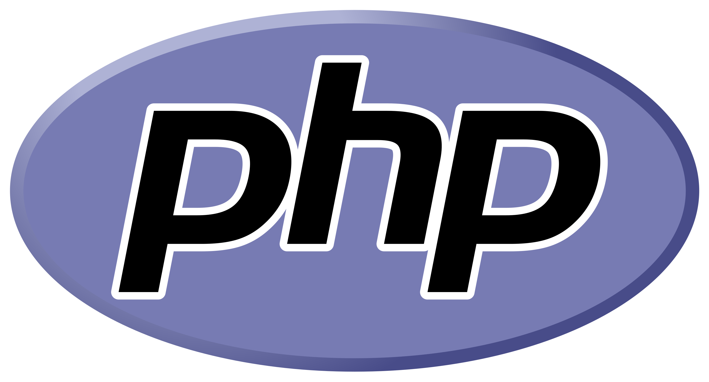

    

<h1 align="center">Curso de PHP para Iniciantes</h1>

Para que você, que é iniciante, aprenda a programar com PHP do jeito certo.

    
    
    
    
    
    

## Requisitos para o curso

* Conhecimentos básicos em lógica de programação.

## Tecnologias utilizadas

* PHP 7.4
* XAMPP (com PHP 7.4)
* Editor de Código (VSCode ou Sublime Text)

## Status do Curso

100% completo.

## Sumário

* O que é o PHP?;
* Configuração do ambiente no Windows;
* Configuração do ambiente no Linux;
* Primeiro projeto;
* Variáveis e constantes;
* Tipos de dados;
* Operadores aritméticos;
* Strings;
* Operadores de comparação;
* Operadores lógicos;
* Estruturas condicionais;
* Arrays;
* Estruturas de repetição;
* Funções;
* Projeto prático: Jogo da Velha - parte 1;
* Projeto prático: Jogo da Velha - parte 2;

## Autor

<a href="https://github.com/frv-dev" style="text-decoration: none;">
    
     
    <b>Felipe Vieira</b>
</a>
 

